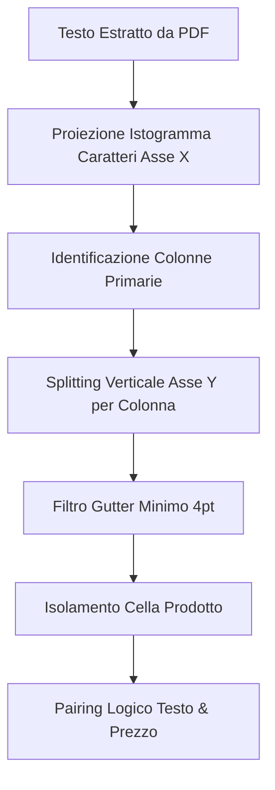

# Architettura del Sistema

Questo documento descrive in dettaglio le scelte progettuali, i pattern e gli algoritmi impiegati nel **GDO Supermarket Scraper**.

---

## 1. Disaccoppiamento e Strategy Pattern

Per supportare catene di supermercati con canali di distribuzione differenti (volantini PDF, API REST, portali web), il sistema adotta lo **Strategy Pattern**:

```
                       AbstractSupermarketDriver [core/base_driver.py]
                                     ▲
                    ┌────────────────┴────────────────┐
                    │                                 │
     AbstractPdfFlyerDriver                AbstractApiSupermarketDriver
    [core/base_pdf_driver.py]               [core/base_driver.py]
            ▲                                         ▲
            │                                         │
  ConadSupermarketDriver                    CoopSupermarketDriver
  INSSupermarketDriver                      DpiuSupermarketDriver
```

* **`AbstractSupermarketDriver`**: Classe base astratta che espone l'interfaccia comune per la ricerca dei negozi (`discover_stores`), il recupero delle promozioni (`fetch_promotions`) e la normalizzazione dei record (`parse_promotions`).
* **`AbstractPdfFlyerDriver`**: Sottoclasse astratta specializzata per i volantini geometrici in formato PDF. Implementa il ciclo ETL spaziale, il rendering grafico della pagina, il caching locale dei file ed il ritaglio visivo dei prodotti.
* **`AbstractApiSupermarketDriver`**: Sottoclasse astratta per supermercati che forniscono direttamente cataloghi promozionali digitali tramite API REST (es. Coop e Dpiù).

---

## 2. Algoritmo di Segmentazione Spaziale (`BasePdfLayoutSegmenter`)

Il parsing dei volantini PDF vettoriali (come quelli di Conad) non segue un ordine di lettura sequenziale. Il modulo `BasePdfLayoutSegmenter` (`core/base_pdf_segmenter.py`) adotta algoritmi geometrici per ricostruire le schede prodotto:



1. **X-Projection (Istogramma dei Caratteri)**: Costruisce un istogramma della densità dei caratteri lungo l'asse X della pagina per rilevare le colonne principali ed evitare di confondere prodotti disposti su colonne diverse.
2. **Y-Splitting**: All'interno di ciascuna colonna rilevata, analizza gli spazi vuoti sull'asse Y per segmentare i singoli blocchi di testo.
3. **Filtro Gutter**: Uno spazio bianco verticale di almeno 4pt viene considerato come delimitatore di riga o cella.
4. **Logical Pairing**: Associa geometricamente ciascun blocco descrittivo (nome prodotto, marca, quantità) al prezzo posizionato più vicino o racchiuso nella stessa cella logica.

---

## 3. Estrazione Visiva delle Immagini Prodotto

Per salvare l'immagine del prodotto isolandola dal rumore grafico del volantino (come bollini promozionali, scritte di prezzo o marchi), il sistema esegue un ritaglio intelligente:

* **Scansione degli Oggetti Raster (`page.images`)**: Rileva le immagini incorporate nativamente nel file PDF.
* **Calcolo delle Intersezioni Geometriche**: Confronta la bounding box della cella prodotto con le coordinate dell'oggetto raster.
* **Image Crop**: Ritaglia l'immagine raster originale isolando l'illustrazione del prodotto.
* **Snapping Grid Fallback**: Se nella cella non sono presenti oggetti raster nativi, il sistema esegue un ritaglio della pagina renderizzata basandosi su una griglia geometrica snappata uniforme.
* **Audit Visivo**: Supporta motori di intelligenza artificiale (Gemini e Claude) come fallback o validatori per correggere bboxes ed identificare record ambigui.

---

## 4. Persistenza e Idempotenza dei Dati

Tutte le offerte normalizzate vengono convalidate tramite modelli **Pydantic** (`core/models.py`) e persistite su database SQLite (`storage/database.py`):

* **Vincolo di Unicità Primario**:
  ```sql
  PRIMARY KEY (supermarket, store_id, offer_id)
  ```
  Questo vincolo garantisce che esecuzioni ripetute dello scraper (anche parziali) aggiornino i record esistenti (**UPSERT**) senza duplicarli.
* **Performance**: SQLite viene inizializzato in **WAL (Write-Ahead Logging) Mode** con un timeout di connessione di 30 secondi, prevenendo blocchi di scrittura simultanei e velocizzando le operazioni di commit.
